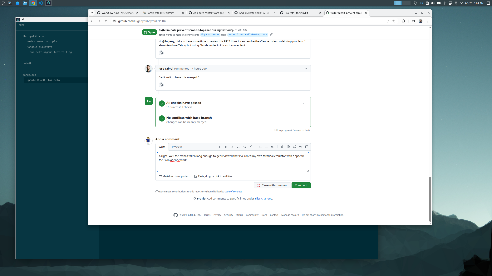

# Mandelbot

A fractal agent tree for agentic development.



Mandelbot is a terminal emulator that organizes agents into a hierarchical tree. Each node is a virtual terminal with its own context, working directory, and prompting — scoped to a layer of work (system, project, change, sub-task). Agents communicate up and down the tree.

## Features

- **Agent control over the terminal.** Agents communicate with the host through an MCP server. They can set their own tab title, report status, and spawn child agents — all without leaving the terminal session.

- **Status indicators.** Each tab shows a color-coded status dot (idle, working, blocked, needs review, error) and a background task counter, so you can see what every agent is doing at a glance.

- **Delegation.** Agents can spawn child tabs and coordinate parallel sub-tasks through a shared status file protocol. Work fans out into a tree and rolls back up.

- **Hierarchical tab tree.** Tabs are organized into a nested sidebar — projects contain tasks, tasks contain sub-tasks. Navigate up, down, and across the tree with keyboard shortcuts.

- **Smart navigation.** Jump directly to the next agent that needs attention. The "next idle" shortcut prioritizes blocked agents, then those needing review, then idle tasks.

## Installing

### macOS (Homebrew)

```sh
brew tap astex/mandelbot
brew install --cask mandelbot
```

### Linux / macOS (shell script)

```sh
curl --proto '=https' --tlsv1.2 -LsSf https://github.com/astex/mandelbot/releases/latest/download/mandelbot-installer.sh | sh
```

Linux users need `libfontconfig1` and `libfreetype6` installed.

## Building from source

Requires [rustup](https://rustup.rs/). The pinned toolchain will be installed automatically.

```sh
cargo build
```

## Status

Beta — stable enough for daily use.
